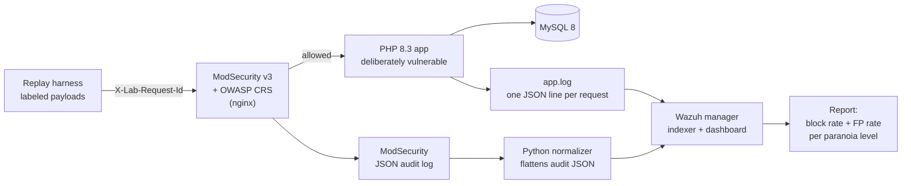

# WAF-to-SIEM Detection Pipeline

> ## Warning
>
> This repository contains a **deliberately vulnerable web application**. It has
> working SQL injection, stored cross-site scripting, path traversal and broken
> access control. It is built to be attacked, in a lab, on a machine that is not
> reachable from anywhere else.
>
> Do not deploy it. Do not expose it to a network you do not control. The Compose
> file binds every published port to `127.0.0.1` on purpose; do not change that
> to `0.0.0.0`.

## What this measures

A web application firewall is standard advice. What it actually buys you is
rarely measured. This project measures it.

A labeled corpus of attack and benign HTTP requests is replayed through
ModSecurity v3 running the OWASP Core Rule Set, at each of the four CRS
paranoia levels, against an application whose vulnerabilities are known and
real. Every request carries a correlation ID, so the firewall's decision and the
application's response can be lined up for the same request. The output is a
block rate and a false positive rate per paranoia level.

The goal is a defensible sentence of the form: *"at paranoia level N the rule
set stopped X percent of attacks and wrongly stopped Y percent of legitimate
traffic, and here is the specific legitimate request it broke."*

## Architecture



The correlation ID is the load-bearing part. The harness stamps every request
with `X-Lab-Request-Id`. The WAF records it in its audit log, the application
records it in its own log, and the two can therefore be joined on that id for
the same request. Without it there are two unrelated piles of logs.

## Status

| Component | State |
|-----------|-------|
| Host environment (WSL2, Docker, toolchain) | Done |
| Vulnerable PHP app, MySQL, structured request log | Done |
| Traffic harness (labeled corpus, replay, report) | Done |
| ModSecurity + CRS reverse proxy (WAF) | Done |
| Python normalizer for the ModSecurity audit log | Not started |
| Wazuh single-node ingest and detection rules | Not started |
| Paranoia-level measurement runs and final report | Not started |

## Host prerequisites

Developed on Windows 11 with WSL2 (Ubuntu 24.04) and Docker Desktop with WSL
integration enabled. Any Linux host with Docker and Compose v2 works.

The repository must live on the Linux filesystem (`~/waf-siem-lab`), not under
`/mnt/c`. See D-0001 in `DECISIONS.md`.

Wazuh's indexer requires `vm.max_map_count` of at least 262144. On WSL2 this is
set for the whole VM, outside this repository, in `%UserProfile%\.wslconfig`:

```ini
[wsl2]
kernelCommandLine = sysctl.vm.max_map_count=1048576
memory=12GB
processors=4
swap=4GB
```

Apply it with `wsl --shutdown` and verify with `cat /proc/cmdline` inside WSL.
See D-0002.

## Quick start

```bash
cp .env.example .env
# edit .env and set your own values
docker compose up -d --build
docker compose ps            # wait for lab-db healthy, lab-waf-init exited 0
```

The WAF is the only host-facing entry point, on <http://localhost:8080>. The app
is not published to the host; it is reachable only through the WAF on the
internal network.

Reseeding the database requires destroying the volume, because MySQL only runs
`db/init/` on an empty data directory:

```bash
docker compose down -v && docker compose up -d --build
```

## The WAF

The `waf` service runs the `owasp/modsecurity-crs:nginx` image as a reverse
proxy in front of the app. Configuration is split so a measurement run changes
exactly one variable:

- `waf/common.env` holds every setting shared across runs: the backend target,
  the rule engine mode, JSON audit logging to `/var/log/modsec/modsec_audit.log`
  on the `modsec_audit` volume, and the anomaly thresholds.
- `waf/pl1.env` through `waf/pl4.env` set only `BLOCKING_PARANOIA`.

Select the paranoia level with the `WAF_PL` variable in `.env`
(`WAF_PL=pl1` .. `pl4`), then `docker compose up -d`. See D-0008.

**Modes.** The rule engine starts in `DetectionOnly` for bring-up (inspect and
score, never block), then is switched to `On` for measurement (enforce blocks).
With `MODSEC_AUDIT_ENGINE=RelevantOnly` and blocking on, the audit log records
exactly the requests that were blocked, which is what the report counts. See
D-0009.

**Audit volume ownership.** The image runs as the unprivileged `nginx` user, but
the `modsec_audit` volume mounts in owned by root. A one-shot `waf-init`
container fixes the ownership before the WAF starts, so the audit log is
writable on a fresh clone with no manual step. See D-0011.

**Custom exclusions.** `waf/rules/REQUEST-900-EXCLUSION-RULES-BEFORE-CRS.conf`
fixes a false positive on apostrophes in the search box, scoped to `/search.php`
and the `q` parameter only. It is a documented remediation, not part of the raw
measurement, so its mount is commented out in `docker-compose.yml` and enabled
only for the tuned comparison run. See D-0010.

**Measurement hygiene.** Replay against `http://localhost:8080`, never
`http://127.0.0.1:8080`. A numeric-IP Host header trips CRS rule 920350 and adds
score to every request, which would inflate the false positive rate with an
artifact of how the client addressed the server. `localhost` is a name, so the
rule does not fire. `replay.py` defaults to `localhost`.

Pin the image by digest in `docker-compose.yml` (not the moving `:nginx` tag) so
a paranoia sweep cannot have the CRS version change underneath it between runs.

## Test accounts

Weak on purpose, so the replay harness can succeed against them.

| Username | Password   | Role  |
|----------|------------|-------|
| admin    | admin123   | admin |
| alice    | password1  | user  |
| bob      | hunter2    | user  |

## The deliberate vulnerabilities

Each endpoint carries exactly one primary defect and uses correct practice
everywhere else, so that a blocked request can be attributed to one known
weakness. See D-0005.

| Endpoint | Class | CWE | Demo | Fix |
|----------|-------|-----|------|-----|
| `search.php` | SQL injection | CWE-89 | `?q=' OR '1'='1` returns all rows | Prepared statement with a bound parameter |
| `product.php` | Stored XSS | CWE-79 | Post a comment containing an `onerror` payload | Escape on output with `htmlspecialchars` |
| `download.php` | Path traversal | CWE-22 | `?file=../../../../etc/passwd` | `realpath()` then verify the resolved path stays under the base directory |
| `admin.php` | Broken access control | CWE-565 | `curl -b 'role=admin'` returns the account table | Read the role from server-side session state and re-check it in the database |
| `login.php` | Username enumeration | CWE-204 | "No such user" differs from "Wrong password" | One identical message for both failures, plus a dummy hash comparison so timing matches |
| `login.php` | No authentication throttling | CWE-307 | Unlimited attempts | Per-account and per-IP failure counters with backoff or lockout |

Secondary issues are annotated in the source but are not the targets of the
replay harness: verbose SQL error disclosure (CWE-209) in `search.php`, and a
missing CSRF token (CWE-352) on the comment form.

Every deliberate weakness is marked in the source with a `VULNERABILITY:`
comment naming the CWE and the one-line fix.

## The traffic harness

`harness/` holds the labeled corpus and the tooling that fires it.

- `harness/payloads/benign.yaml`, `bruteforce.yaml`, `enum.yaml` are generated
  by `gen_corpus.py` and tied to the seed data.
- The `sqli`, `xss` and `traversal` sets are built from PayloadsAllTheThings by
  `build_attacks.py`, with a citation in every entry. See `payloads/ATTACKS.md`
  and D-0006.
- `bruteforce` and `enum` are labeled `expected: allow`, because they are not
  single-request WAF-blockable; their detection is a SIEM correlation job. See
  D-0007.
- `replay.py` sends each payload with a fresh `X-Lab-Request-Id` and records
  status and blocked/allowed to `results/<label>.csv`.
- `report.py` joins the results with the WAF and app logs on the correlation id
  and prints block rate and false positive rate per category.

## Application log schema

Every request appends exactly one JSON object to `/var/log/app/app.log`, which
lives on the `app_logs` named volume so later containers can read it. See
D-0004.

| Field | Meaning |
|-------|---------|
| `ts` | RFC 3339 UTC timestamp with milliseconds |
| `request_id` | Value of the `X-Lab-Request-Id` header, or `"none"` |
| `method` | HTTP method |
| `path` | Request path, query string excluded |
| `client_ip` | First value of `X-Forwarded-For`, else the socket peer |
| `user` | Authenticated username, or `null` |
| `role` | Role in effect for the request, or `null` |
| `outcome` | Short result token, for example `search_ok`, `download_denied`, `admin_allowed` |
| `db_error` | PDO error text when a query failed, else `null` |

An `outcome` of `unhandled` means the request died before setting one, which is
itself a signal worth alerting on.

Inspect it with:

```bash
docker compose exec -T app cat /var/log/app/app.log | jq -c '[.request_id, .outcome]'
```

## Repository layout

```
waf-siem-lab/
├── DECISIONS.md            architecture decision log
├── docker-compose.yml
├── .env.example            copy to .env; .env is never committed
├── app/
│   ├── Dockerfile          php:8.3-apache + pdo_mysql
│   ├── src/                application source
│   └── specs/              spec sheets, outside the document root
├── db/
│   └── init/               schema and seed, run once on first start
├── waf/
│   ├── common.env          shared WAF config
│   ├── pl1.env .. pl4.env   paranoia level only
│   └── rules/              custom exclusion (documented remediation)
└── harness/
    ├── replay.py
    ├── report.py
    └── payloads/           corpus and generators
```

## Decisions

`DECISIONS.md` records every non-obvious choice made while building this, with
the alternative that was rejected and why. Read it before the code.

## Secrets

No credentials, private keys or certificates are committed. `.env` is ignored;
`.env.example` documents the shape. Wazuh's TLS material is generated locally
and is excluded by `.gitignore`, which means a fresh clone needs the generation
step rather than working immediately. That tradeoff is deliberate and is
recorded in `DECISIONS.md`.